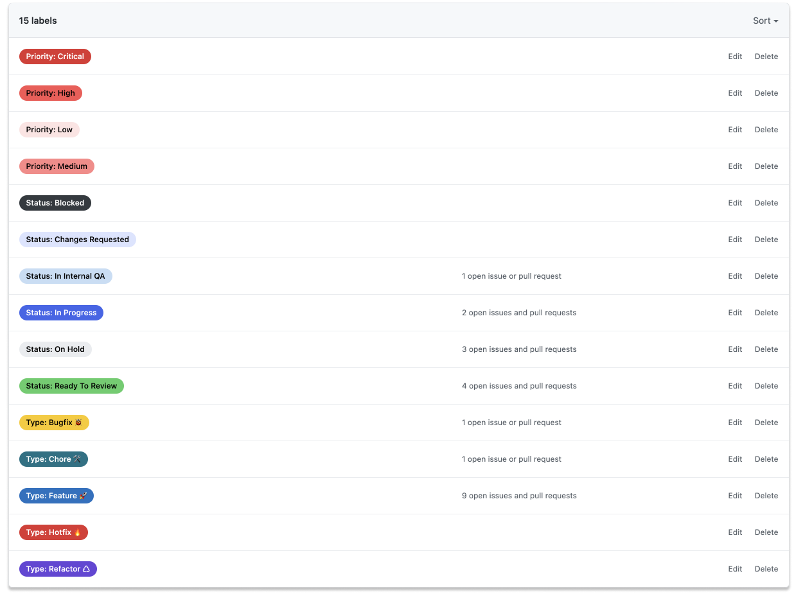
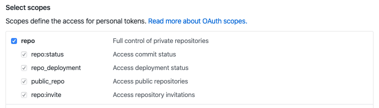
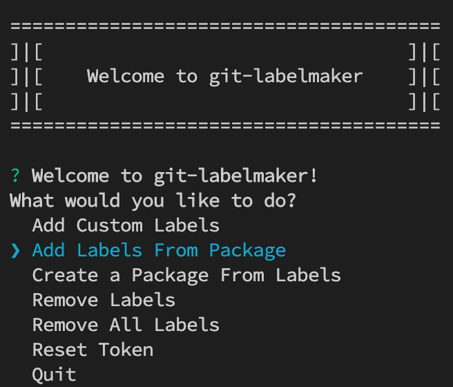

<p align="center">
    
</p>

<p align="center">
    
</p>

<h1 align="center">
    GitHub Labels
</h1>

<h4 align="center">
    Enhance Github labelling system, in a Pixelmatters' way.
</h4>

<p align="center">
    <a href="https://github.com/Pixelmatters/eslint-config-pixelmatters/blob/master/LICENSE">
        
    </a>
    <a href="https://github.com/Pixelmatters/eslint-config-pixelmatters/blob/master/CONTRIBUTING.md">
        
    </a>
    <a href="https://twitter.com/intent/follow?screen_name=pixelmatters_">
      
    </a>
</p>

## Why use this

Managing pull requests in a collaborative project can be a bit frustrating. When facing a long list of PRs, usually developers ask themselves:
- What is this PR/issue about?
- Did they already tackled the changes that I requested?
- Which issues/PRs are the most priority?
- Is this ready for my code review?
- Can I merge this one?

Unfortunately on GitHub, and other platforms, default labels are usually not the best or the right ones for your collaboration needs. So, we decided to document the solution that we use at Pixelmatters aiming a more efficient PRs management. **You may not know it yet, but we're quite obsessed by the efficiency of our communication and processes.**

<p align="center">
    
</p>

## How it works

We use the following three **three different label categories**. Each issue or pull request can only contain one label of each type:

- **Status** - used to check the state/progress of your work during different stages of development;
- **Type** - used to check, as the name implies, the type of each issue/PR, for instance, a "Bug", "Feature", etc;
- **Priority** - used to differentiate between issues/PR that are most critical to solve. This makes tackling the essential issues a lot easier, especially when you have tons of issues/PR.

<p align="center">
    
</p>

It may seem like a small improvement, but when you have around +20 pull requests or so this system can really shine and make Product Owners and Developers' jobs a whole lot easier.

> ❗️ **You must use the recommended colors** so we can get used to those, improving readability.

## How to use it

1. Install `git-labelmaker` globally

    ```bash
    yarn global add git-labelmaker

    OR

    npm i -g git-labelmaker
    ```

2. Go into your git repository and run the following command

    ```bash
    git-labelmaker
    ```

3. `git-labelmaker` will ask you for a token, that you can get by (the example is for GitHub):
    1. Clicking your profile picture
    2. Settings
    3. Developer settings
    4. Personal access tokens
    5. Generate a new token and make sure to provide repo permissions.

        

        Then copy the token (which you can only see at this point) and paste it into the terminal. 

    6. If all went well, you'll be greeted with the following menu, where you have to pick *Add Labels From Package.* and point to `pixelmatters-github-labels.json` file in this repository.

        

<hr>

Inspired by the excellent article [Sane GitHub Labels](https://medium.com/@dave_lunny/sane-github-labels-c5d2e6004b63) from [@Dave Lunny](https://medium.com/@dave_lunny).